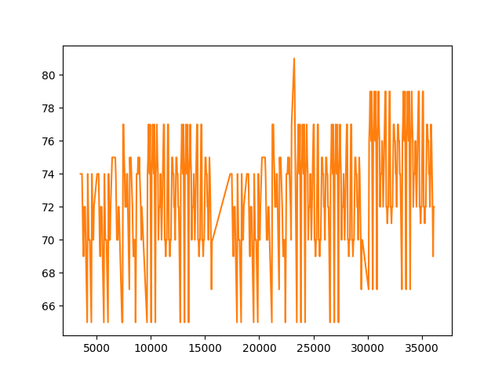
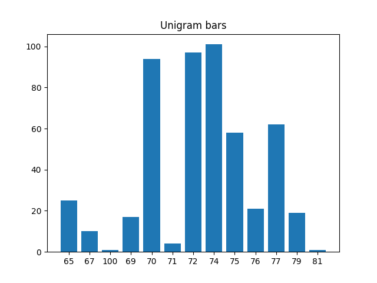

# Music-Analyser
Midi Music analysis tools and code collection, including statistical music models.

**Requirements**
Python 2.7
Use pip install -r requirements.txt to install packages.

# Tools
1. **play midi**
Run:  
python tools.py midi_file.mid --play  
For example:  
python tools.py anjing.mid --play  

2. **plot midi**
Run:  
python tools.py midi_file.mid --play  
For example:  
python tools.py anjing.mid --play  

3. **Basic music analysis**
Extract music inforamtion including Unigrams and Bigrams.  
Run:  
python midi_analyser.py midi_file.mid  
For example:  
python midi_analyser.py anjing.mid  

4. **Generate midi music based on statistical language models**
Run:  
python midi_generator.py midi_file.mid  
For example:  
python midi_generator.py anjing.mid  

Example based on anjing.mid:  
[Music link](https://www.youtube.com/watch?v=KV64yCc-0Y4)  

I will keep updating this project. Will Do: Add chords module. Generate midi based on chords as well as traning midi files.

I am a music fan. I would like to explore music creation, especially using machine learning to genereate music in the future. I would like to hear about any suggestion or comments. I am also looking for collcaboration oppertunities or working oppertunity. Thank you!

**Plot of one band of midi** 

**Plot of unigrams**

**Plot of bigrams**

